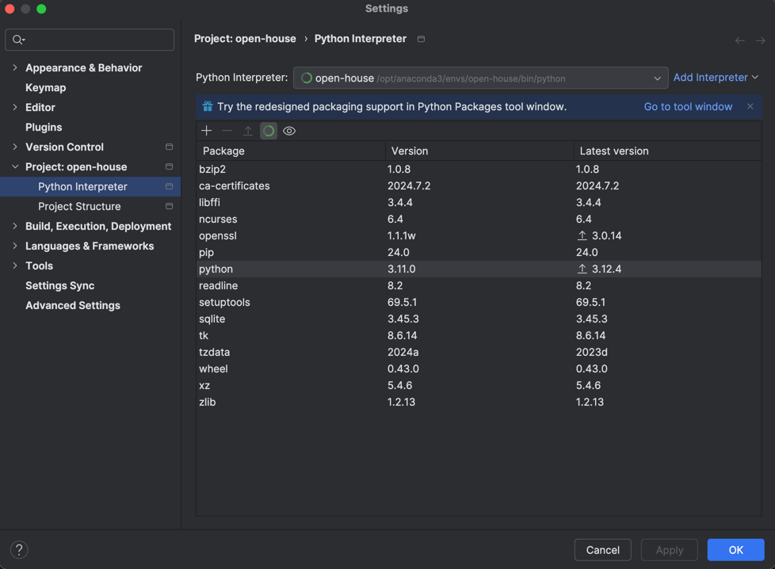

# Welcome to Project Open House

## Team
- Diane
- Owen
- Luis
- Maggie
- Maddie
- Spencer

# Project Overview
## Problem Statement
In Sydney, the current inflation rate of 6% is quite high. Renters are seeking to rent properties at the best price. However, the market average price is not easily accessible to renters. This project aims to provide renters with a tool that can help them find agents who typically offer rental prices lower or higher than the market average price in Sydney.

## Our Data
We have a dataset of rental properties in Sydney. The dataset contains information about the property, the agent, and the price. The dataset is a collection of 12 files, in total containing approximately 30000 records. The dataset is in CSV format. Not all data is clean, and some data is missing. We believe this data was scraped from a real estate website.

## Our Approach
We will use machine learning to predict the market average price of rental properties in Sydney. We will then use this prediction to identify agents who offer rental prices lower or higher than the market average price. Then, we will build a web application that will allow people to explore the data and find agents who offer rental prices lower or higher than the market average price.

# Important Milestones
## Cleaning the Data
Cleaning the data to make it usable for machine learning was a critical step. We needed to handle missing data, parse inconsistently structured data, and convert data types. 

### Data Cleaning Steps
The major blocker was inconsistent data. Specifically, the Weekly Price column was not consistently formatted. 

Here is an example of the data inconsistency just for this column:
```
- $550.00
- $750 pw
- $870 per week incl Water bill and Solar Power
- $1,200 Per Week
- $680 weekly
- Contact Agent
```

We needed to come up with a complex regex pattern to extract the weekly price from the text. After many, many iterations, we were able to accurately extract the weekly price from the text.

Even still, we had to handle missing data. We decided to drop rows with impactful missing data, as we had enough data to work with. These columns included Month Listed and Post Code. We also removed all non-Housing or Unit plots. Commercial, Industrial, and Land plots skewed our data and did not align with our goals. 

### Measuring our Model's Accuracy
We used the RMSE provided by AWS Sagemaker's regression model to measure our model's accuracy. We were able to achieve an RMSE of about 160, which we believe is a solid start. If we were provided with more data, or even more complete data, we believe we could improve this score.

# _Dev Setup_

## Step 1: Installing Anaconda and Python
First install Anaconda and make sure you have Python 3.11.x

[Python](https://www.python.org/downloads/release/python-3110/)

[Anaconda](https://www.anaconda.com/download)
## Step 2: Installing Interpreter
```angular2html
PyCharm -> Settings -> Python Interpreter -> Add New Interpreter -> Add Local Interpreter -> 
Conda Environment -> Create new environment -> Set Python Version to 3.11 -> Click OK
```
## Step 3: Confirm Python Version 3.11.0
```angular2html
Make sure Python's Version is set to 3.11.0.
If not, double click the version -> Specify Version -> 3.11 -> Wait for install -> Reset IDE
```


## Step 4: Test Interpreter is setup

```angular2html
python ./tests/test_version.py
```

### Result should be something similar to this
```angular2html
3.11.0 (main, Mar  1 2023, 12:33:14) [Clang 14.0.6 ]
```

## Step 5: Install Requirements
### Anytime you want to add a library make sure to add it to the .txt
```angular2html
pip install -r ./requirements.txt
```

## Step 6: Download Data
### Follow this [link](https://northeastern-my.sharepoint.com/:f:/r/personal/igortn_northeastern_edu/Documents/DoCs/UTS-Projects/Rental%20prediction?csf=1&web=1&e=IPnzKu) to access data.

In a git bash terminal run this to create a folder labeled `data` in `open-house` or just create the folder.

```angular2html
mkdir data
```

Download files labeled part 1-12. Add to the data folder.
Run data-imports.py. This will create `housing_data.csv`

## *Interacting with AWS*
Install [AWS CLI](https://aws.amazon.com/cli/) and install [boto3](https://pypi.org/project/boto3/) and login

Once you have done and logged in, run this:
```angular2html
python ./tests/test_boto3.py
```
The output should look something like this:
```angular2html
Existing buckets:
  silly-australia-bucket
```

To see the sample S3 JSON run this:
```angular2html
python ./tests/test_squid.py
```