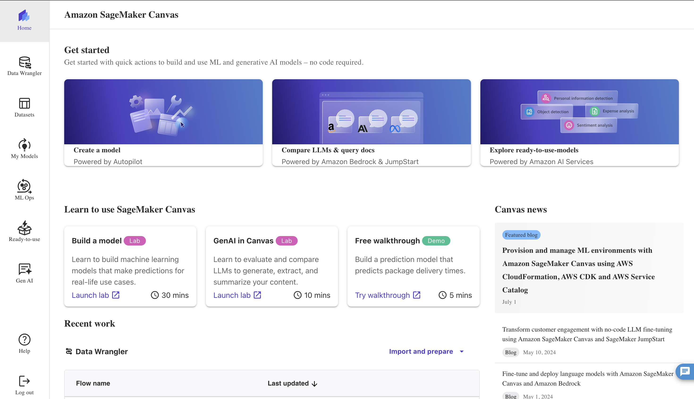
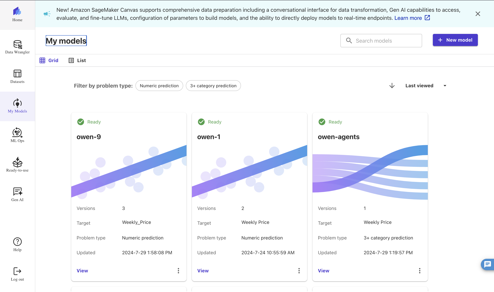
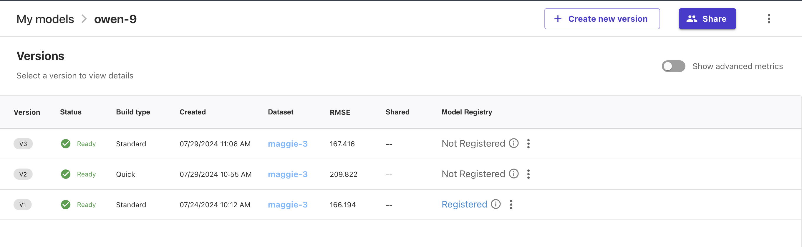
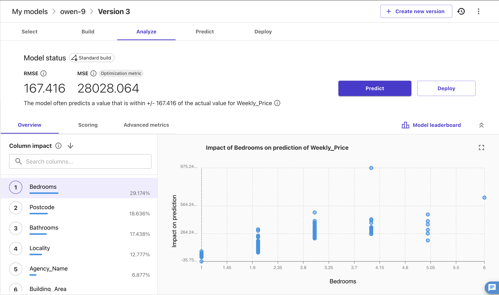
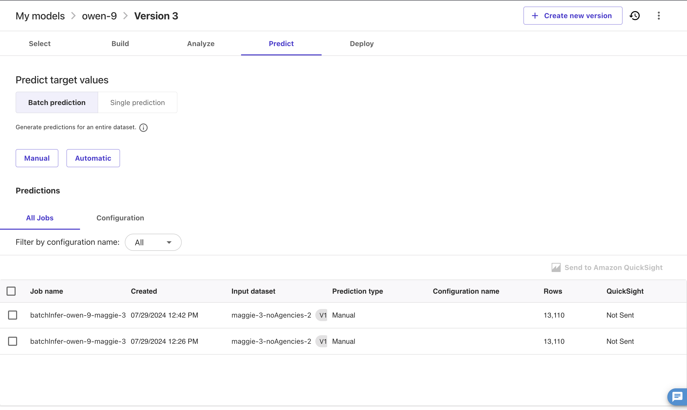

# Rank Agencies

One of our main deliverables is to use machine learning to analyse and evaluate the data with
the goal of determining which agencies are best suited for which practices.

We aimed to streamline this process using AWS Sagemaker, where we made models that are able to
predict prices of housing units when agents and agencies are not taken into account.

# How-to

### This prediction can be achieved in one of two ways:

## Manual

- With the trained models already created, the script in `counting-agencies` can be run to
  automatically generate a `csv` file without agents or agencies which gets stored in our
  own S3 Bucket.
- A dataset can be generated from this S3 Bucket in the Sagemaker Canvas page and a prediction
  can be made.

### 1. Enter AWS SageMaker Canvas

### 2. Enter My Models

### 3. Select a model

### 4. Create a version (if necessary)

### 5. Select a version

### 6. Enter the "Predict" tab

### 7. Run a Manual Prediction

This can be done as the script automatically generates a dataset without the Agency and Agents
and adds it to the S3 Bucket, which can then be selected to create a new dataset for the prediction.

### - Click on Manual

### - Click on "Create dataset"

### - Name the dataset

### - Click on "Select a new Data Source"

### - Select "Amazon S3"

### - Select "team-houses-bucket"

### - Select "housing-data-noAgencies"

### - Create the dataset and run the prediction on it

### 8. This prediction will get stored to the S3 bucket and can be analysed by hitting ENTER whilst running the script

This will generate the comparative graphs and `csv` file which will get stored in the S3 Bucket as
well

## Automatic

### 1. Type "N" when prompted whilst running the script and wait for the results (this could be a while)

Results will be uploaded to the S3 bucket but can take a really long time to process (12 hrs for
all ~13,000 the data points)